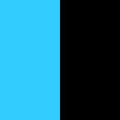

# Image Pattern

[](https://badge.fury.io/py/image-pattern)


image_pattern - библиотека для создания шаблонов, изображений и 
генерации изображений из данных шаблонов с использованием изменяющегося контента.

## Зачем всё это?

Часто возникает необходимость генерировать однотипные изображения с меняющимся контентом.
К примеру, изображения для расшаривания в социальные сети или создания аватара пользователя из имени
(если фото для аватара не задано).

Хотелось иметь декларативный способ описания шаблонов изображений, и простую генерацию изображений из них.
Надеюсь, у меня получилось.

## Установка

```shell script
pip3 install image-pattern
```

## Начнем

Для начала нам нужно создать сам паттерн. Мы будем создавать паттерн изображения аватара.
Паттерн изображения задается с помощью класса ```Pattern``` следующим образом:

```python
from image_pattern import Pattern


class Avatar(Pattern):
    pass
```

Каждый паттерн изображения состоит из двух компонентов:

* canvas - настройки полотна изображения, например размера;
* layers - слои, содержащие контент изображения;

```python
from image_pattern import (
    Pattern,
    Canvas,
)


class Avatar(Pattern):
    canvas = Canvas(size=(200, 200))
```

В данном случае мы создали паттерн для изображения 200x200,
но пока не содержит никакого контента.

Теперь, когда у нас есть шаблон,
мы можем сгенерировать из него изображение с помощью следующего кода:

```python
avatar_pattern = Avatar()
image = avatar_pattern.render()
image.save('avatar.jpg', 'JPEG')
```

И мы получим следующее изображение:


Теперь нам нужно задать для него контент.
Начнем с добавления первого слоя:

```python
from __future__ import annotations
from typing import List
from image_pattern import (
    Pattern,
    Canvas,
    Layer,
    Rectangle,
    Point,
)


class Avatar(Pattern):
    canvas = Canvas(
        size=(200, 200),
    )
    layers: List[Layer] = [
        Layer(
            Rectangle(
                size=(100, 200),
                point=Point(x=0, y=0),
                background_color=(51, 204, 255),
            ),
            Rectangle(
                size=(100, 200),
                point=Point(x=100, y=0),
                background_color=(255, 51, 153),
            ),
        ),
    ]


avatar_pattern = Avatar()
image = avatar_pattern.render()
image.save('avatar.jpg', 'JPEG')
```

Запустим скрипт и получим следующее изображение:


Что же здесь происходит:
* Мы добавили список слоев layers, который содержит один слой.
* Данный слой содержит два прямоугольника;
* Свойство ``size`` задает размер прямоугольника в пикселях;
* Свойство ```point``` задает точку на холсте, обозначающую верхний левый угол элемента;
* Свойство ```background_color``` задает цвет прямоугольника в системе _RGB_.

Подробнее об элементах и их свойствах можно узнать из раздела _API_.

После просмотра данного примера может возникнуть резонный вопрос: Зачем же нам нужны слои, если мы могли бы писать всё разом?
Дело в том, что паттерн следит, чтобы в пределах одного слоя не происходило наложения элементов.
К примеру, если мы сместим правый прямоугольник на 50 пикселей левее внутри одного слоя, чтобы он наехал на левый прямоугольник:

```python
...
        Layer(
            Rectangle(
                size=(100, 200),
                point=Point(x=0, y=0),
                background_color=(51, 204, 255),
            ),
            Rectangle(
                size=(100, 200),
                point=Point(x=50, y=0),
                background_color=(255, 51, 153),
            ),
        ),
...
```

мы сгенерируем следующее изображение:



Как мы видим правый прямоугольник пропал с изображения.
Если мы увеличим высоту изображения, то мы увидим, куда он исчез:

```python
...
class Avatar(Pattern):
    canvas = Canvas(
        size=(200, 400),
    )
...
```


Как мы видим, правый прямоугольник сместился вниз, чтобы не пересекаться с левым прямоугольником в этом же слое.
Правило смещения элементов очень простое - элементы всегда смещаются вниз.
Это особенно полезно для работы с текстами. Когда длина текста неизвестна.

Но, если мы вернем высоту в 200 пикселелей и расположим прямоугольники в разных слоях:

```python
...
    layers: List[Layer] = [
        Layer(
            Rectangle(
                size=(100, 200),
                point=Point(x=0, y=0),
                background_color=(51, 204, 255),
            ),
        ),
        Layer(
            Rectangle(
                size=(100, 200),
                point=Point(x=50, y=0),
                background_color=(255, 51, 153),
            ),
        ),
    ]
...
```

то мы сможем сгенерировать следующее изображение:


Как мы видим, прямоугольники накладываются друг на друга.
Это происходит потому что слои служат специально для того,
чтобы накладывать элементы друг на друга.

Итак, теперь нам нужно написать на нашем изображении текст.
Для этого нам понадобится элемент текст и новый слой:

```python
...
        Layer(
            Text(
                text='Image Pattern',
                font=FONT_PATH,
                font_color=(255, 255, 255),
                font_size=42,
                point=Point(x=0, y=0),
                margin=Position(
                    top=20,
                    left=20,
                    right=20,
                ),
            )
        ),
...
```

Подробнее об элементе текст можно прочитать в разделе _API_.
Запустив скрипт мы получим следующее изображение:


Как мы видим шаблон учитывает перенос текста по словам, если для текста не хватает пространства.
Так же мы можем указывать шрифт, выравнивание и отступы.

Давайте поместим первые буквы слов по центру изображения:

```python
...
from image_pattern import (
    ...
    HorizontalAlignment,
    VerticalAlignment,
)
...
        Layer(
            Text(
                text='IP',
                font=FONT_PATH,
                font_color=(255, 255, 255),
                font_size=102,
                point=Point(x=100, y=100),
                margin=Position(
                    left=20,
                    right=20,
                ),
                horizontal_alignment=HorizontalAlignment.CENTER,
                vertical_alignment=VerticalAlignment.CENTER,
            ),
        ),
...
```

Мы получили следующее изображение:


Хмм... Как мы видим, есть ощущение, что текст не по середине изображения.
Однако, это не совсем так. Это происходит потому что шаблон изображения использует для выравнивания ширины всей строки.
А так как ширина буквы ```I``` меньше ширины буквы ```P```, то текст выглядит как бы смещенным.

Чтобы избавиться от этого эффекта, попробуем поместить каждую букву в центр её прямоугольника следующим образом.

```python
...
            Text(
                text='I',
                font=FONT_PATH,
                font_color=(255, 255, 255),
                font_size=102,
                point=Point(x=50, y=100),
                margin=Position(
                    left=20,
                    right=20,
                ),
                horizontal_alignment=HorizontalAlignment.CENTER,
                vertical_alignment=VerticalAlignment.CENTER,
            ),
            Text(
                text='P',
                font=FONT_PATH,
                font_color=(255, 255, 255),
                font_size=102,
                point=Point(x=150, y=100),
                margin=Position(
                    left=20,
                    right=20,
                ),
                horizontal_alignment=HorizontalAlignment.CENTER,
                vertical_alignment=VerticalAlignment.CENTER,
            ),
...
```

Выполнив скрипт, мы получим следующее изображение:


Замечательно!

Но что нам делать, если нам нужно регулярно изменять текст на изображении?
Для этого шаблон предусматривает передачу контекста:

```python
...
from image_pattern import (
    ...
    Context,
)
...
class AvatarContext(Context):
    first_char: str
    second_char: str
...
            Text(
                text=AvatarContext.var('first_char'),
                ...
            ),
            Text(
                text=AvatarContext.var('second_char'),
                ...
            ),
...
context = AvatarContext(
    first_char='I',
    second_char='P',
)
avatar_pattern = Avatar(context=context)
...
```

Теперь мы можем изменять контент генерируемого изображения, не меняя при этом сам шаблон.
Полный код примера смотрите в ```./examples/avatar.py```.

## API

Все классы унаследованные от ```pydantic.BaseModel``` для валидации передаваемых аргументов, что накладывает определенную специфику при работе с апи.

### Pattern

Базовый класс шаблона.
От него необходимо унаследовать шаблон.
Для создания шаблона необходимо переопределить следующие атрибуты:

* canvas - атрибут типа ```Canvas```. Задает свойства холста.
* layers - атрибут типа ```List[Layer]```. Задает список слоев.

#### Конструктор объекта принимает следующие аргументы:

* context - аргумент типа ```Context```, который будет передан элементам для формирования их свойств.

#### Методы объекта:

* render - возвращает сгенерированный объект изображения типа ```PIL.Image```;
* render_to_blob(**save_kwargs) - возвращает сгенерированный объект изображения типа ```io.BytesIO```. Принимает параметры, передаваемые в метод ```PIL.Image.save()```, такие как ```quality``` и т.д. [Подробнее](https://pillow.readthedocs.io/en/stable/reference/Image.html#PIL.Image.Image.save). Нельзя передавать формат изображения, так как оно сохраняется в ```JPEG```. Сделан просто для удобства использования результатов генерации.
    
### Canvas

Объект, описывающий свойства холста.

#### Конструктор объекта принимает следующие аргументы:

* size - размер холста. Может быть задан как ```Tuple[int, int]```, так и переменной контекста.

### Layer

Объект, описывающий слой, содержащий контент изображения.
Слои накладываются друг на друга, начиная от первого в списке - нижнего, и заканчивая самым последним в списке - верхним слоем.

#### Конструктор объекта принимает следующие аргументы:

* *elements - список элементов ```Recatngle``` или ```Text```, для добавления на изображение.

### Context

Объект, описывающий контекст изображения. Контекст описывается атрибутами объекта.
Контекст является наследником ```pydantic.BaseModel```, поэтому требует описания типов для осуществления валидации.

#### Методы объекта:

* var(attribute_name: str) - указывает какую переменную контекста использовать для данного атрибута.

### Позиционируемые элементы

#### Rectangle

Объект, добавляющий прямоугольники на изображение.

##### Конструктор объекта принимает следующие аргументы:

* point - объект ```Point```, указывающий на верхний левый угол элемента на изображении;
* horizontal_alignment - одно из значений перечисления HorizontalAlignment, для указания выравнивания по горизонтали. Может быть задано переменной контекста. По умолчанию - ```HorizontalAlignment.LEFT```;
* vertical_alignment - одно из значений перечисления VerticalAlignment, для указания выравнивания по вертикали. Может быть задано переменной контекста. По умолчанию - ```VerticalAlignment.TOP```;
* size - размер элемента. Может быть задан как ```Tuple[int, int]```, так и переменной контекста;
* brightness - задает яркость элемента. Необязательный аргумент. Может быть представлен значением ```float``` от 0 до 1, или переменной контекста;
* background_image - задает фоновое изображение для элемента. Необязательный аргумент. Должно задавать путь к изображению. Так же может быть представлено переменной контекста. Фоновое изображение масштабируется подобно указанию в css - ```background-size: cover;```.
* background_color - задает цвет фона элемента. Необязательный аргумент если задан ```background_image```. Используется при генерации элемента только тогда, когда не задано свойство ```background_image```. 
Может быть представлено как RGB ```Tuple[int, int, int]```, так и RGBA ```Tuple[int, int, int]```. Может быть задано переменной контекста.
* alpha - задание альфа канала элемента. Необязательный аргумент. Может быть представлено как ```int``` от 0 до 255. Может быть задано переменной контекста.

#### Text

Объект, добавляющий текст на изображение.

##### Конструктор объекта принимает следующие аргументы:

* point - объект ```Point```, указывающий на верхний левый угол элемента на изображении;
* horizontal_alignment - одно из значений перечисления HorizontalAlignment, для указания выравнивания по горизонтали. Может быть задано переменной контекста. По умолчанию - ```HorizontalAlignment.LEFT```;
* vertical_alignment - одно из значений перечисления VerticalAlignment, для указания выравнивания по вертикали. Может быть задано переменной контекста. По умолчанию - ```VerticalAlignment.TOP```;
* font - задает используемый для текста шрифт. Представлен в качесте пути к OpenType или TrueType шрифту. Может быть задан переменной контекста;
* font_size - задает размер шрифта. Может быть представлен ```int``` или переменной контекста. По умолчанию - ```12```;
* font_color - задает цвет шрифта в формате RGB ```Tuple[int, int, int]```. Может быть задан переменной контекста. По умолчанию - ```(0, 0, 0)```;
* text - задает, непосредственно, сам текст, добавляемый на изображение. Может быть представлен как ```str```, так и переменной контекста;
* line_height - задает высоту строки. Необязательный аргумент. Может быть представлен как ```int```, так и переменной контекста;
* margin - задает отступы для текста относительно холста. Необязательный аргумент. Может быть представлен как объектом ```Position```, так и переменной контекста;

### Вспомогательный объекты

#### Point

Описывает точку на холсте.

##### Конструктор объекта принимает следующие аргументы:

* x - x координата в виде, представленная как ```int```;
* y - y координата в виде, представленная как ```int```.

#### Position

Описывает позицию элемента относительно сторон холста. Например отступы для текста.

* top - позиция относительно верхнего края холста, представленная как ```int```;
* right - позиция относительно правого края холста, представленная как ```int```;
* bottom - позиция относительно нижнего края холста, представленная как ```int```;
* left - позиция относительно левого края холста, представленная как ```int```.

### Перечисления

#### HorizontalAlignment

Предоставляет варианты выравнивания по горизонтали.

##### Значения

* HorizontalAlignment.LEFT - выравнивание относительно левого края;
* HorizontalAlignment.CENTER - выравнивание относительно центра;
* HorizontalAlignment.RIGHT - выравнивание относительно правого края.

#### VerticalAlignment

Предоставляет варианты выравнивания по вертикали.

##### Значения

* VerticalAlignment.TOP - выравнивание относительно верхнего края;
* VerticalAlignment.CENTER - выравнивание относительно центра;
* VerticalAlignment.BOTTOM - выравнивание относительно нижнего края.

### Интеграции

#### Django

Для интеграции с django пакет предоставляет поле ```image_pattern.cotrib.ImagePatternField```, унаследованное от ```django.db.models.ImageField```.
Поле имеет предустановленный элемент ```blank = True``` относительно ```ImageField```, а так же ряд новых аргументов:

* pattern - шаблон для генерации изображения;
* context - ```callback``` метод объекта, возвращающий контекст для генерации изображения. Необязательный аргумент.
Если метод не задан, то будет использоваться метод объекта ```get_image_pattern_context```;
* should_be_created - ```callback``` метод объекта, указывающий на необходимость генерации изображения. Необязательный аргумент.
Если метод не задан, то будет использоваться метод объекта ```image_pattern_should_be_created```.

Изображение генерируется в том случае, если поле является пустым и ```should_be_created``` возвращает ```True```.
Подробнее работу ```ImagePatternField``` можно рассмотреть в проекте примере в ```./django_example```.

### TODO

- [ ] Сделать возможность выбирать формат изображения.
- [ ] Сделать что-нибудь с автокомплитом для создания объектов(Так как все объекты наследуются от pydantic.BaseModel, то они не содержат мета информации для автокомплита. Возможно нужно вручную написать все конструкторы.).
- [ ] Подумать над использованием контекста. Использование Context.var() со строковым именем выглядит не самым оптимальным способом.
- [ ] Сделать возможность смещения в пределах слоя не только вниз, но и вправо.
- [ ] Задание центра фонового изображения.
- [ ] Рефакторинг тестов и доведение coverage до 100%.
- [ ] Настроить linter.
- [ ] Доделать првеку через mypy.
- [ ] Прикрутить github actions.
